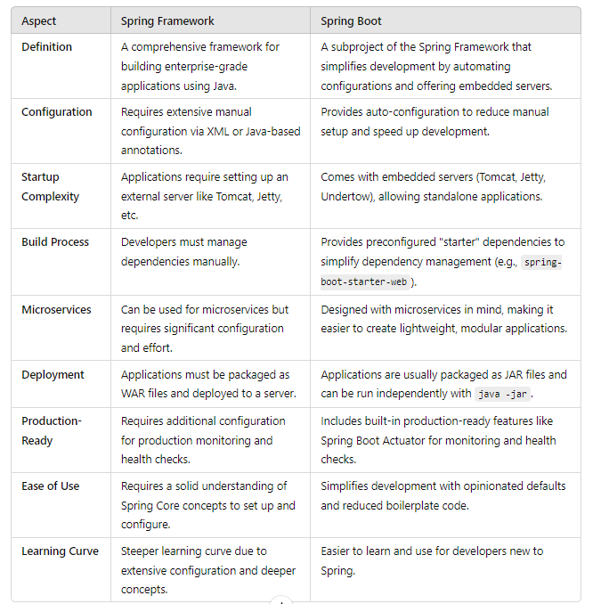
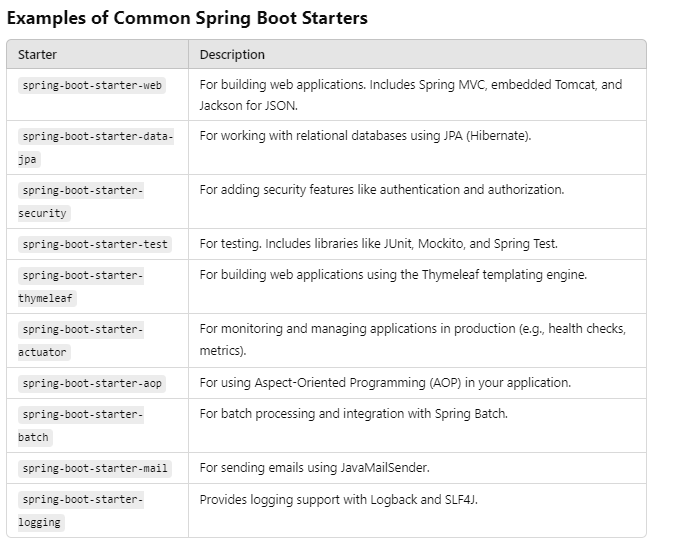
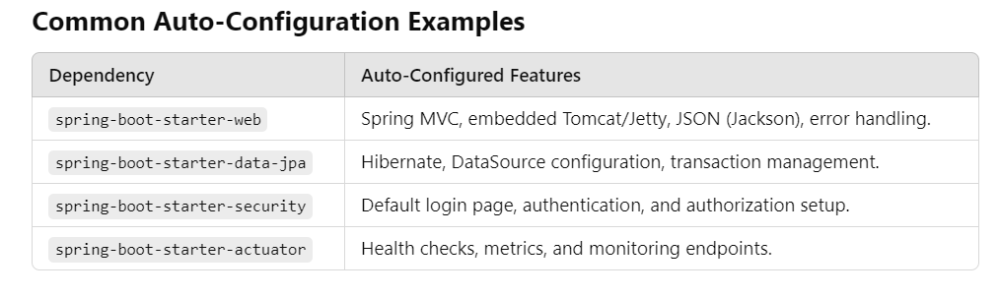
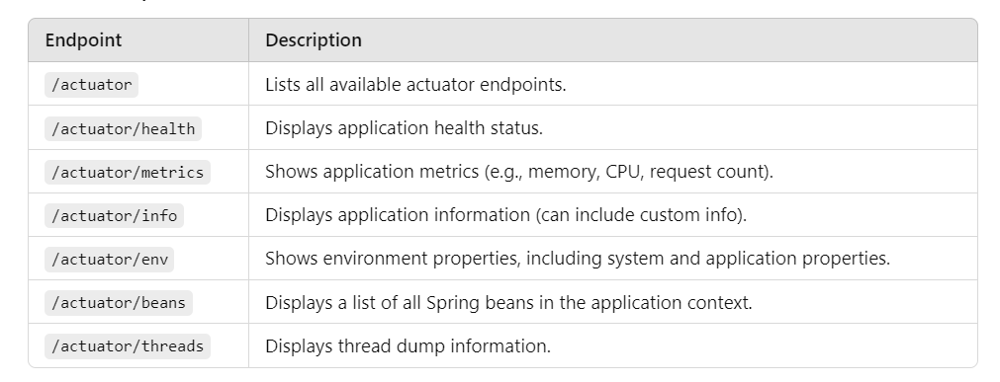
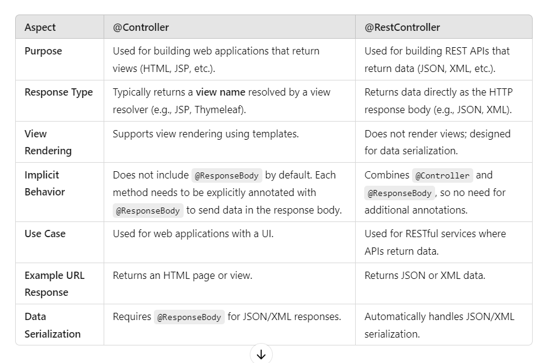
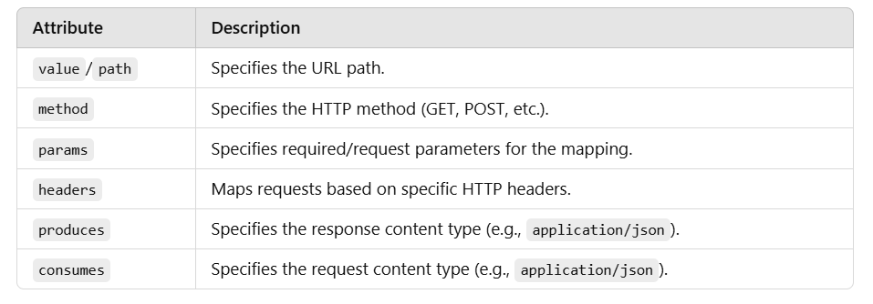
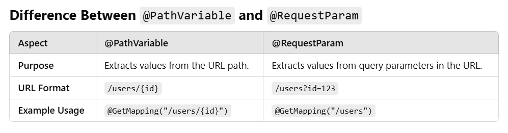
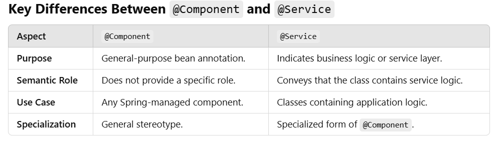

# spring-boot-interview-corner

### 1. What is Spring Boot, and why is it used?
- Spring boot is Java-based framework built on top of the Spring Framework. It simplifies the development of spring applications by providing features like auto-configuration, embedded servers, and pre-configured templates.
  It eliminates the need for extensive XML or annotation-based configuration, allowing developers to focus on writing business logic.

  #### Why is Spring Boot used?
  Spring Boot is used to accelerate the development of production-ready applications with minimal effort. It offers

  ##### 1. Ease of Development:
    - Reduces boilerplate code and setup time.
  ##### 2. Embedded Servers:
    - Applications can run independently without external server deployment (e.g., Tomcat).
  ##### 3. Microservices-Friendly:
    - It’s ideal for developing lightweight microservices.
  ##### 4. Production-Ready Tools:
    - Includes monitoring, metrics, and health checks via Actuator.
  ##### 5. Integration:
    - Leverages the power of the Spring ecosystem, making it easy to implement features like security, data access, or messaging.

### 2.	Explain the difference between Spring Framework and Spring Boot.

#### Interview Explanation:
Spring Framework is a robust framework for building Java-based applications, but it often requires significant manual configuration and setup. In contrast, Spring Boot is designed to streamline and simplify the development process by offering opinionated defaults, auto-configuration, and embedded servers.

For example:

In **Spring Framework**, you need to configure a DataSource, EntityManagerFactory, and TransactionManager manually.

In **Spring Boot**, you only need to add dependencies like spring-boot-starter-data-jpa and provide application properties (e.g., database URL). Everything else is auto-configured.

**Why Spring Boot?**

Spring Boot addresses the complexity of configuring Spring Framework and speeds up development, making it particularly useful for modern microservices-based architectures.

### 3. What is the role of @SpringBootApplication?

**Role of** @SpringBootApplication **Annotation**

**@SpringBootApplication** is a composite annotation in Spring Boot that marks a class as the main entry point of a Spring Boot application. It combines three important annotations and provides default configurations to bootstrap the application.

**Breakdown of** @SpringBootApplication

@SpringBootApplication is equivalent to using the following three annotations together:

1. ``@EnableAutoConfiguration``

    - Enables Spring Boot's auto-configuration feature.
    - Automatically configures Spring components and beans based on the dependencies in the classpath (e.g., setting up a ``DataSource`` if JDBC is present).

2. ``@ComponentScan``

    - Scans the package of the annotated class and its sub-packages for Spring components like ``@Component,`` ``@Service,`` ``@Repository,`` and ``@Controller.``
    - Ensures all required beans are discovered and registered in the application context.
3. ``@Configuration``

    - Indicates that the class can define **Spring configuration** using Java-based configuration (instead of XML).
    - Allows defining`` @Bean ``methods to provide custom bean definitions.

**Why Use @SpringBootApplication?**

1. **Convenience:**

    - Instead of using ``@EnableAutoConfiguratio``,  ``@ComponentScan,`` and ``@Configuration`` separately, you can use the single ``@SpringBootApplication`` annotation to achieve the same functionality.
2. **Entry Point:**
    - It marks the main class of the application where the main method resides.
    - This is the starting point for the **SpringApplication.run()** method, which bootstraps the application.

**Example Usage**

```java
import org.springframework.boot.SpringApplication;
import org.springframework.boot.autoconfigure.SpringBootApplication;

@SpringBootApplication
public class MySpringBootApplication {
    public static void main(String[] args) {
        SpringApplication.run(MySpringBootApplication.class, args);
    }
}

```

Here’s what happens when the application starts:

**Auto-Configuration:** Configures beans automatically based on classpath dependencies.

**Component Scanning:** Detects Spring-managed components in the current package and sub-packages.

**Configuration Loading:** Loads custom configurations defined in the application class or elsewhere.

### Customizing Behavior
**Excluding Auto-Configuration:**
- If you want to exclude specific auto-configurations, you can do this:
```java
@SpringBootApplication(exclude = {DataSourceAutoConfiguration.class})
public class MyApp { ... }

```
**Custom Component Scanning:**
- If your components are in a different package, specify the base package:
```java
@SpringBootApplication(scanBasePackages = "com.example.mycomponents")
public class MyApp { ... }

```
### 4. How does Spring Boot simplify dependency management?

**How Spring Boot Simplifies Dependency Management**

Spring Boot simplifies dependency management through Starter Dependencies, Maven BOM (Bill of Materials), and its opinionated approach to pre-configuring commonly used libraries. This significantly reduces the effort required to manage dependencies in your project.

**Key Features of Dependency Management in Spring Boot**

1. **Starter Dependencies**

    - Spring Boot provides starter dependencies, which are curated sets of commonly used libraries bundled together.
    - These starters eliminate the need to specify individual dependencies for a specific functionality.
    - **Example:**
        - To build a web application, you only need to add spring-boot-starter-web to your pom.xml or build.gradle.

```xml
<dependency>
    <groupId>org.springframework.boot</groupId>
    <artifactId>spring-boot-starter-web</artifactId>
</dependency>

``` 
This starter automatically includes dependencies like:

- Spring MVC
- Embedded Tomcat server
- Jackson for JSON processing

2. **Version Management with BOM**

    - Spring Boot uses a Bill of Materials (BOM) to manage dependency versions.
    - This ensures that all dependencies in your project are compatible with each other.
    - Developers don’t have to worry about version conflicts or manually specifying versions for Spring-related libraries.

Example in ``pom.xml``

```xml
<dependencyManagement>
    <dependencies>
        <dependency>
            <groupId>org.springframework.boot</groupId>
            <artifactId>spring-boot-dependencies</artifactId>
            <version>3.1.4</version>
            <type>pom</type>
            <scope>import</scope>
        </dependency>
    </dependencies>
</dependencyManagement>

```

3. **Opinionated Defaults**

    - Spring Boot chooses the most suitable libraries and versions for you based on its opinionated model.
    - For example, if you use spring-boot-starter-data-jpa, it automatically includes Hibernate, eliminating the need to figure out and configure dependencies manually.
4. **Reduced Boilerplate**

    - Without Spring Boot, you'd need to manage several individual dependencies for a simple feature.
    - Spring Boot bundles related dependencies under a single starter, minimizing the number of lines in the dependency list.

   Example Comparison: **Without Starter Dependencies (Traditional Spring):**
```xml
<dependency>
    <groupId>org.springframework</groupId>
    <artifactId>spring-core</artifactId>
</dependency>
<dependency>
    <groupId>org.springframework</groupId>
    <artifactId>spring-web</artifactId>
</dependency>
<dependency>
    <groupId>org.springframework</groupId>
    <artifactId>spring-aop</artifactId>
</dependency>
<!-- And more... -->

```
**With Starter Dependency (Spring Boot):**
```xml
<dependency>
    <groupId>org.springframework.boot</groupId>
    <artifactId>spring-boot-starter-web</artifactId>
</dependency>

```

5. **Simplified Upgrades**

    - Upgrading Spring Boot versions automatically updates the versions of all related dependencies, ensuring compatibility.
    - This reduces the risk of runtime errors caused by version mismatches.
6. **Custom Starters**

    - Developers can create their own custom starter dependencies to package specific functionality, enabling consistent dependency management across teams or projects.

**Advantages in Real-World Use**

**Time Savings:** Developers focus on building features instead of managing dependency conflicts.

**Reduced Complexity:** No need to research and configure individual library versions.

**Consistency:** Projects built with the same Spring Boot version maintain consistent dependencies.

### 5. What is the Spring Boot Starter? Give examples.
A **Spring Boot Starter** is a **pre-defined set of dependencies** provided by Spring Boot to simplify project setup and configuration. These starters bundle commonly used libraries and frameworks needed for a specific functionality into a single dependency, eliminating the need to include and configure each dependency manually.

**Key Features of Spring Boot Starters**

**Convenience:** Simplifies dependency management by bundling related libraries.

**Auto-Configuration:** Works with Spring Boot's auto-configuration to reduce boilerplate setup.

**Version Management:** Ensures all included libraries are compatible with each other.

**Time-Saving:** Developers can add one dependency to enable specific features instead of adding multiple related dependencies.



### 6. Explain auto-configuration in Spring Boot.
Auto-configuration is a key feature of Spring Boot that automatically configures your application based on the dependencies and settings available in your project. It eliminates the need for manual configuration by providing sensible defaults and enabling required beans and configurations automatically.

**How Does Auto-Configuration Work?**

1. **Dependency Detection:**

    - Spring Boot examines the dependencies in the classpath (e.g., spring-boot-starter-web).
    - Based on these dependencies, it identifies the components or beans needed for the application.

2. **Conditional Beans:**

    - Auto-configuration classes include conditional logic using annotations like ``@ConditionalOnClass,`` ``@ConditionalOnMissingBean,`` and ``@ConditionalOnProperty.``
    - Example:
        - If ``spring-boot-starter-web`` is on the classpath, Spring Boot auto-configures beans for Spring MVC, an embedded web server (like Tomcat), and Jackson for JSON processing.

3. **Configuration Classes:**

    - Auto-configuration is driven by classes annotated with ``@EnableAutoConfiguration.``
    - These classes are listed in ``META-INF/spring.factories`` in the Spring Boot JARs.
    - Example: ``WebMvcAutoConfiguration``, ``DataSourceAutoConfiguration``.

4. **Customization:**

    - Defaults can be overridden by providing custom beans or configuration in your application.

**Example of Auto-Configuration**

Without Auto-Configuration (Traditional Spring): In a traditional Spring application, you must configure a DataSource manually for database connectivity:

```java
@Configuration
public class DataSourceConfig {
    @Bean
    public DataSource dataSource() {
        DriverManagerDataSource dataSource = new DriverManagerDataSource();
        dataSource.setDriverClassName("com.mysql.cj.jdbc.Driver");
        dataSource.setUrl("jdbc:mysql://localhost:3306/mydb");
        dataSource.setUsername("root");
        dataSource.setPassword("password");
        return dataSource;
    }
}

```
**With Auto-Configuration (Spring Boot):** Spring Boot automatically configures the DataSource if it detects the necessary dependencies (spring-boot-starter-data-jpa and mysql-connector-java) and properties (spring.datasource.*) in application.properties:
```java
spring.datasource.url=jdbc:mysql://localhost:3306/mydb
spring.datasource.username=root
spring.datasource.password=password
spring.jpa.hibernate.ddl-auto=update

```

**Key Annotations Used in Auto-Configuration**

``@EnableAutoConfiguration``:

- Enables Spring Boot’s auto-configuration feature.
- Usually included via @SpringBootApplication.

``@ConditionalOnClass:``

- Configures beans only if a specific class is present in the classpath.

``@ConditionalOnMissingBean:``

- Configures a bean only if it’s not already defined in the application context.

``@ConditionalOnProperty:``

- Activates configuration based on specific properties.

**Advantages of Auto-Configuration**

1. **Reduces Boilerplate Code:**
- You don’t need to write extensive configuration classes for common setups.

2. **Quick Setup:**

- Applications can be up and running with minimal configuration.

3. **Customizable**:

- bDefaults can be overridden to suit specific needs.

4. **Scalable:**

- Simplifies adding new features by enabling relevant starters.

**Disabling Auto-Configuration**

If auto-configuration is not desired, you can disable it:

1. Using ``@SpringBootApplication:``

```java
@SpringBootApplication(exclude = {DataSourceAutoConfiguration.class})
public class MyApplication { }

```

2. Using ``application.properties:``

```java
spring.autoconfigure.exclude=org.springframework.boot.autoconfigure.jdbc.DataSourceAutoConfiguration

```


### 7. What is the Spring Boot Actuator, and how do you use it?

**Spring Boot Actuator** is a module in Spring Boot that provides a set of production-ready features to help monitor and manage applications. It exposes various endpoints that give insights into the application’s health, metrics, environment, configurations, and more.

This tool is particularly useful for operational purposes, such as debugging, auditing, performance monitoring, and diagnostics.


**Key Features of Spring Boot Actuator**

1. **Endpoints for Monitoring and Management:**

   - Provides REST API endpoints for various metrics and health checks.
   - Examples: ``/actuator/health, /actuator/metrics, /actuator/env.``
2. **Customizable Endpoints:**

    - You can enable, disable, or secure specific endpoints as needed.
3. **Integration with Monitoring Tools:**

    - Works seamlessly with tools like Prometheus, Grafana, and Micrometer for performance monitoring.
4. **Insight into Application State:**

    - Displays runtime details such as active beans, environment variables, memory usage, and thread details.


**How to Use Spring Boot Actuator**

**Step 1: Add Actuator Dependency**

Include the Spring Boot Actuator starter in your pom.xml or build.gradle.

**Maven:**
```xml
<dependency>
    <groupId>org.springframework.boot</groupId>
    <artifactId>spring-boot-starter-actuator</artifactId>
</dependency>

```

**Gradle:**

```
implementation 'org.springframework.boot:spring-boot-starter-actuator'

```
**Step 2: Configure Actuator Endpoints**

By default, only the ``/actuator/health`` and ``/actuator/info`` endpoints are exposed. To enable or customize endpoints, update the ``application.properties`` or ``application.yml`` file.

**Example: Enable All Endpoints**

```
management.endpoints.web.exposure.include=*

```
**Example: Enable Specific Endpoints**

```
management.endpoints.web.exposure.include=health,info,metrics
```
**Example: Secure Endpoints** Use Spring Security to restrict access:

```
management.endpoint.health.roles=ADMIN

```

**Step 3: Access Actuator Endpoints**

Default Endpoints:



**Step 4: Customize Health Checks and Info**

**Custom Health Indicator:** You can create a custom health check by implementing the HealthIndicator interface:

```java
import org.springframework.boot.actuate.health.Health;
import org.springframework.boot.actuate.health.HealthIndicator;
import org.springframework.stereotype.Component;

@Component
public class CustomHealthIndicator implements HealthIndicator {
    @Override
    public Health health() {
        // Add custom logic
        return Health.up().withDetail("custom", "Everything is fine").build();
    }
}

```

**Custom Info:** Add custom application info in application.properties:

```
info.app.name=Demo Application
info.app.version=1.0.0

```
Access via ``/actuator/info.``


**Step 5: Integrate with Monitoring Tools**

**Micrometer:** Integrates with Actuator to provide application metrics.

**Prometheus:** Use the prometheus endpoint to export metrics.

**Grafana:** Visualize metrics using dashboards.

**Cloud Providers:** Integrate with AWS CloudWatch, Azure Monitor, etc.

**Advantages of Spring Boot Actuator**

1. **Quick Monitoring Setup:**

    - Minimal configuration required to enable health checks and metrics.
2. **Production Readiness:**

    - Provides detailed runtime insights to ensure application stability.
3. **Integration-Friendly:**

    - Works with many third-party monitoring and alerting tools.
4. **Customizable and Extendable:**

    -Create custom endpoints or health indicators based on business needs.

**Example Use Case**

Suppose you want to monitor an e-commerce application for uptime and performance. Using Actuator, you can:

- Check if the application is running (``/actuator/health``).
- Monitor request throughput and response times (``/actuator/metrics``).
- Diagnose memory leaks using a thread dump (``/actuator/threads``).

### 8. How do you handle application properties in Spring Boot?
Spring Boot provides a flexible way to configure application settings using property files. These configurations can be set in ``application.properties`` or ``application.yml`` files, externalized configurations, environment variables, or even command-line arguments.

**1. Configuring Properties in application.properties or application.yml**

   **Default Location:**
   These files are typically located in `src/main/resources`.

   **Example** `application.properties`:
```
server.port=8081
spring.datasource.url=jdbc:mysql://localhost:3306/mydb
spring.datasource.username=root
spring.datasource.password=password
logging.level.org.springframework=DEBUG
```
**Example** `application.yml`:
```
server:
  port: 8081

spring:
  datasource:
    url: jdbc:mysql://localhost:3306/mydb
    username: root
    password: password

logging:
  level:
    org.springframework: DEBUG

```
**2. Accessing Properties in Code**

**Using** `@Value` **Annotation**:

   You can inject individual properties directly into fields or methods.

**Example:**

```java
import org.springframework.beans.factory.annotation.Value;
import org.springframework.stereotype.Component;

@Component
public class MyService {
    @Value("${server.port}")
    private int serverPort;

    @Value("${spring.datasource.url}")
    private String dataSourceUrl;

    public void printProperties() {
        System.out.println("Server Port: " + serverPort);
        System.out.println("DataSource URL: " + dataSourceUrl);
    }
}

```
**Using** `@ConfigurationProperties`:

For managing multiple related properties, use the @ConfigurationProperties annotation. This maps property keys to fields in a class.

**Example:**

1. Enable configuration properties in the main class:

```java
@SpringBootApplication
@EnableConfigurationProperties(MyProperties.class)
public class DemoApplication {
    public static void main(String[] args) {
        SpringApplication.run(DemoApplication.class, args);
    }
}

```
2. Create a class for properties:
```java
import org.springframework.boot.context.properties.ConfigurationProperties;
import org.springframework.stereotype.Component;

@Component
@ConfigurationProperties(prefix = "myapp")
public class MyProperties {
    private String name;
    private int timeout;

    // Getters and Setters
    public String getName() {
        return name;
    }
    public void setName(String name) {
        this.name = name;
    }
    public int getTimeout() {
        return timeout;
    }
    public void setTimeout(int timeout) {
        this.timeout = timeout;
    }
}

```
3. Define properties in `application.properties`:
```
myapp.name=My Application
myapp.timeout=30

```
4. Use the properties:

```
@Autowired
private MyProperties myProperties;

System.out.println(myProperties.getName());
System.out.println(myProperties.getTimeout());

```
**3. Externalizing Configuration**

   Spring Boot allows external configuration of properties for easier environment-specific setups (e.g., dev, test, prod).

**Priority of Configuration Sources:**

1. Command-line arguments
2. Environment variables
3. `application.properties` or `application.yml`
4. Default settings

**Environment-Specific Properties:**

1. Create files like `application-dev.properties` or `application-prod.properties`.
2. Activate a profile in `application.properties`:
```
spring.profiles.active=dev

```
**4. Using Profiles for Environment Management**

   Profiles allow you to define separate configurations for different environments.

**Example Setup:**

1. `application-dev.properties`:
```
server.port=8082
logging.level.org.springframework=DEBUG

```
2. `application-prod.properties`:
```
server.port=8080
logging.level.org.springframework=ERROR

```
3. Activate the desired profile:
```
spring.profiles.active=prod
```

**5. Binding Complex Properties**

   You can define and bind hierarchical properties to Java classes using @ConfigurationProperties.

**Example for Nested Properties:**

`application.yml:`
```
app:
  settings:
    retries: 5
    timeout: 30

```
**Java Class:**
```java
@ConfigurationProperties(prefix = "app.settings")
@Component
public class AppSettings {
    private int retries;
    private int timeout;

    // Getters and Setters
}

```
**6. Overriding Properties**

   You can override properties using:

1. Command-line arguments:
```
java -jar app.jar --server.port=9090

```
2. Environment Variables:
```
export SPRING_DATASOURCE_URL=jdbc:mysql://localhost:3306/anotherdb

```
3. System Properties:
```
java -Dspring.datasource.username=admin -jar app.jar

```
**7. Encrypting Sensitive Properties**

   Sensitive data like passwords can be encrypted using third-party tools like Jasypt or Spring Cloud Config.


### 9. What is the use of @RestController?
The `@RestController` annotation in Spring Boot is a specialized version of the `@Controller` annotation. It is used to create RESTful web services by combining the functionalities of` @Controller` and `@ResponseBody`.

When you annotate a class with `@RestController`, Spring Boot automatically handles HTTP requests and serializes Java objects into JSON (or other formats like XML) in the HTTP response body.

**Key Features of @RestController:**

1. **Simplifies REST API Development:**

    - No need to explicitly annotate methods with `@ResponseBody` as it's included in `@RestController`.
2. **Handles HTTP Requests**:

    - Maps HTTP requests (like `GET`, `POST`, `PUT`, `DELETE`) to specific methods using `@RequestMapping` or HTTP-specific annotations (`@GetMapping`, `@PostMapping`, etc.).
3. **Automatic JSON Conversion**:

    - Converts Java objects to JSON responses using the Jackson library (or other configured message converters).
4. **Lightweight:**

    - Primarily used for APIs, not for rendering web views like JSP or Thymeleaf.
   
**Usage Example**

1. Basic Example:
```java
import org.springframework.web.bind.annotation.GetMapping;
import org.springframework.web.bind.annotation.RequestMapping;
import org.springframework.web.bind.annotation.RestController;

@RestController
@RequestMapping("/api")
public class MyRestController {

    @GetMapping("/hello")
    public String sayHello() {
        return "Hello, World!";
    }
}

```
- URL to access: `http://localhost:8080/api/hello`
- Response: `Hello, World!`

**2. Returning JSON Data:**
```java
import org.springframework.web.bind.annotation.GetMapping;
import org.springframework.web.bind.annotation.RestController;

@RestController
public class UserController {

    @GetMapping("/user")
    public User getUser() {
        return new User(1, "John Doe", "john.doe@example.com");
    }
}

class User {
    private int id;
    private String name;
    private String email;

    // Constructor, Getters, and Setters

    public User(int id, String name, String email) {
        this.id = id;
        this.name = name;
        this.email = email;
    }

    // Getters and setters (omitted for brevity)
}

```
- **URL to access:** `http://localhost:8080/user`
- **Response (JSON):**

```json
{
  "id": 1,
  "name": "John Doe",
  "email": "john.doe@example.com"
}

```
**Why Use `@RestController`?**

- To simplify the development of RESTful APIs.
- It reduces boilerplate code (no need to annotate each method with `@ResponseBody`).
- Ensures efficient and easy JSON serialization for HTTP responses.
- Widely used for microservices architecture where APIs communicate using JSON or XML.

### 10. Explain the difference between @Controller and @RestController.
`@Controller` and `@RestController` are both Spring annotations used to define controller classes, but they serve different purposes depending on the nature of the application (web-based vs. RESTful). Here's a detailed comparison:



**Examples**

1. **Example of** `@Controller`:

```java
import org.springframework.stereotype.Controller;
import org.springframework.web.bind.annotation.GetMapping;
import org.springframework.ui.Model;

@Controller
public class WebController {

    @GetMapping("/home")
    public String homePage(Model model) {
        model.addAttribute("message", "Welcome to the home page!");
        return "home";  // Resolves to "home.html" or "home.jsp"
    }
}

```
**Purpose:**

- Used for applications that render views (e.g., an HTML page like `home.html`)

**Behavior:**

- The `return "home"` tells Spring to look for a view named home using the configured view resolver.


2. **Example of** `@RestController`:

```java
import org.springframework.web.bind.annotation.GetMapping;
import org.springframework.web.bind.annotation.RestController;

@RestController
public class ApiController {

    @GetMapping("/api/greeting")
    public String greeting() {
        return "Hello, World!";
    }
}

```
**Purpose:**

- Used for APIs that return data (e.g., `Hello, World!` as plain text or JSON).

**Behavior:**

- Automatically serializes the return value into the HTTP response body (e.g., JSON).

**Key Differences in Behavior**

**Without** @ResponseBody

If you use` @Controller` and don't specify `@ResponseBody`, Spring assumes the method is returning a view name, not raw data.

**With** `@RestController`

Using `@RestController` eliminates the need for `@ResponseBody` on each method because it’s implied that the controller handles RESTful responses.


**When to Use What?**

- **Use** `@Controller`:

    - For traditional web applications with a user interface that renders HTML or other view templates like Thymeleaf, JSP, etc.
- **Use** `@RestController`:

    - For RESTful services or microservices where the application primarily provides data as JSON or XML responses.


### 11. 	What is @RequestMapping and its variants?

`@RequestMapping` is an annotation in Spring Framework used to map HTTP requests to specific handler methods in a controller class. It allows developers to define the URL path, HTTP method, and other request-mapping details.

In addition to `@RequestMapping`, Spring provides method-specific variants like `@GetMapping`, `@PostMapping`, `@PutMapping`, `@DeleteMapping`, and `@PatchMapping` for convenience.

**1. @RequestMapping**

   **Purpose:**
   Maps HTTP requests to controller methods.

- **Attributes:**

**Example:**
   ```java
   import org.springframework.web.bind.annotation.RequestMapping;
   import org.springframework.web.bind.annotation.RequestMethod;
   import org.springframework.web.bind.annotation.RestController;
   
   @RestController
   @RequestMapping("/api")
   public class MyController {
   
       @RequestMapping(value = "/greet", method = RequestMethod.GET)
       public String greet() {
           return "Hello, World!";
       }
   }
   
   ```
  - URL to access: `http://localhost:8080/api/greet`
  - HTTP Method: `GET`

**2. Variants of @RequestMapping**

   Spring introduced method-specific annotations for common HTTP methods to make code more concise and readable.


**2.1 @GetMapping**

   - Used for handling GET requests.
   - **Example:**
   ```
@GetMapping("/users")
public List<String> getUsers() {
    return List.of("Alice", "Bob", "Charlie");
}
```
**2.2 @PostMapping**

   - Used for handling POST requests.
   - **Example:**
   ```java
   @PostMapping("/users")
   public String createUser(@RequestBody String user) {
      return "User " + user + " created!";
}

   ```
**2.3 @PutMapping**

   - Used for handling PUT requests.
   - **Example:**
   ```java
    @PutMapping("/users/{id}")
   public String updateUser(@PathVariable int id, @RequestBody String user) {
      return "User with ID " + id + " updated to " + user;
}

   ```
**2.4 @DeleteMapping**

   - Used for handling DELETE requests.
   - **Example:**


```java
@DeleteMapping("/users/{id}")
public String deleteUser(@PathVariable int id) {
    return "User with ID " + id + " deleted!";
}

```

**2.5 @PatchMapping**

   - Used for handling PATCH requests (partial updates).
   - **Example:**

```java
@PatchMapping("/users/{id}")
public String updateUserPartial(@PathVariable int id, @RequestBody Map<String, Object> updates) {
    return "User with ID " + id + " partially updated!";
}

```
**Advanced Examples**

**Mapping with Parameters:**
```java
@RequestMapping(value = "/filter", method = RequestMethod.GET, params = "type=admin")
public String filterAdmins() {
    return "Filtered admin users";
}

```
- Access URL:` /filter?type=admin`

**Mapping with Headers:**
```java
@RequestMapping(value = "/headers", headers = "X-Custom-Header=my-header")
public String withHeaders() {
    return "Custom header present!";
}

```
- Access URL: Add the header `X-Custom-Header=my-header` to the request.

**Mapping with Content Type (Consumes/Produces):**
```java
@RequestMapping(value = "/json", method = RequestMethod.POST, consumes = "application/json", produces = "application/json")
public String handleJson(@RequestBody String json) {
    return "{\"message\": \"Received JSON\"}";
}

```
- **Consumes**: Specifies the type of request body.
- **Produces**: Specifies the type of response body.

**When to Use @RequestMapping or Variants**

- Use `@RequestMapping`:

   - For complex mappings (e.g., with parameters, headers, or multiple attributes).
   - For backward compatibility with older Spring versions.
**Use HTTP-Specific Variants:**
   - For simple, single-method mappings (e.g., `GET`, `POST`).
   - To make code more readable and concise.

### 12. What is @PathVariable, and how is it used?

`@PathVariable` is an annotation in Spring Framework used to extract values from the URL path in a RESTful API. It binds the values from the URL directly to the method parameters, making it easy to handle dynamic parts of a URL.

**Key Features of @PathVariable:**

1. **Dynamic URL Parameters:**

    - Enables handling URLs with dynamic segments (e.g., `/users/{id}`).
2. **Binding Path Variables to Method Parameters:**

    - Automatically maps URL segments to method parameters.
3. **Customization:**

    - Allows specifying a different name for the variable in the URL and the method parameter.

**How to Use** `@PathVariable`

**Basic Example:**
```java
import org.springframework.web.bind.annotation.GetMapping;
import org.springframework.web.bind.annotation.PathVariable;
import org.springframework.web.bind.annotation.RestController;

@RestController
public class UserController {

    @GetMapping("/users/{id}")
    public String getUserById(@PathVariable int id) {
        return "User with ID: " + id;
    }
}

```
- URL: `http://localhost:8080/users/101`
-  Response: `User with ID: 101`

**Using Multiple** `@PathVariable`:

```java
@GetMapping("/users/{userId}/orders/{orderId}")
public String getOrderDetails(@PathVariable int userId, @PathVariable int orderId) {
    return "Order " + orderId + " for User " + userId;
}

```
- URL: `http://localhost:8080/users/1/orders/45`
- Response: `Order 45 for User 1`

**Customizing the Path Variable Name:**

If the path variable name in the URL and the method parameter are different, you can specify the mapping explicitly.

```java
@GetMapping("/products/{productId}")
public String getProduct(@PathVariable("productId") int id) {
    return "Product with ID: " + id;
}

```
- URL: `http://localhost:8080/products/20`
- Response: `Product with ID: 20`

**Advanced Features**

**Path Variables with Regular Expressions:**

You can restrict the format of path variables using regular expressions.

```java
@GetMapping("/users/{id:[0-9]+}")
public String getUserById(@PathVariable int id) {
    return "User ID: " + id;
}

```
- Acceptable URL:` http://localhost:8080/users/123`
- Invalid URL: `http://localhost:8080/users/abc` (will return a 404 error).



**Best Practices for Using @PathVariable:**
1. **Use** `@PathVariable` **for IDs or other essential URL parameters.**

    - E.g., /`users/{id}` is more intuitive than `/users?id=123`.
2. **Avoid overusing dynamic segments.**

    - Use query parameters (`@RequestParam`) for optional or non-essential data.
3. **Validate Path Variables.**

    - Use regular expressions in the mapping or add validation logic in the method.

### 13. How is @RequestParam used?
`@RequestParam` is an annotation in the Spring Framework used to extract query parameters from the URL of an HTTP request and bind them to method parameters in a controller. It is commonly used for retrieving optional or additional data sent along with the request.

**Key Features of `@RequestParam`**

1. **Maps Query Parameters:**
Extracts parameters from the query string of the URL (e.g., ?key=value).

2. **Binds Query Parameters to Method Parameters:**
Automatically binds query parameters to Java method parameters.

3. **Customization:**
Allows setting default values and marking parameters as required or optional.


**How to Use `@RequestParam`**

**Basic Example**
```java
import org.springframework.web.bind.annotation.GetMapping;
import org.springframework.web.bind.annotation.RequestParam;
import org.springframework.web.bind.annotation.RestController;

@RestController
public class ExampleController {

    @GetMapping("/greet")
    public String greet(@RequestParam String name) {
        return "Hello, " + name + "!";
    }
}

```
- URL:` http://localhost:8080/greet?name=John`
- Response: `Hello, John!`

**Setting Default Values**

  You can provide a default value for a query parameter if it is not supplied in the request.
```java
@GetMapping("/greet")
public String greet(@RequestParam(defaultValue = "Guest") String name) {
    return "Hello, " + name + "!";
}

```
- URL without parameter: `http://localhost:8080/greet`
- Response: `Hello, Guest!`
- 
**Optional Query Parameters**

  You can make a query parameter optional by setting required = false.
```java
@GetMapping("/greet")
public String greet(@RequestParam(required = false) String name) {
    if (name == null) {
        return "Hello, Guest!";
    }
    return "Hello, " + name + "!";
}

```
- URL without parameter: `http://localhost:8080/greet`
- Response: `Hello, Guest!`

**Multiple Query Parameters**

You can handle multiple query parameters in the same method.

```java
@GetMapping("/user")
public String getUserDetails(@RequestParam String name, @RequestParam int age) {
    return "User: " + name + ", Age: " + age;
}

```
- URL: `http://localhost:8080/user?name=Alice&age=25`
- Response: `User: Alice, Age: 25`

**Using Collections as Parameters**

You can bind query parameters to a List or Set.

```java
@GetMapping("/numbers")
public String getNumbers(@RequestParam List<Integer> nums) {
    return "Numbers: " + nums.toString();
}

```
- URL: `http://localhost:8080/numbers?nums=1&nums=2&nums=3`
- Response: `Numbers: [1, 2, 3]`

**Best Practices for @RequestParam**

1. **Use Default Values:**
Avoid `NullPointerException` or unnecessary validation checks by providing default values.

2. **Mark Optional Parameters:**
Use `required = false` for query parameters that may not always be present.

3. **Use Descriptive Parameter Names:**
Ensure parameter names are self-explanatory for better readability and usability.

4. **Validate Query Parameters:**
Use validation annotations like `@Min`,` @Max`, or custom validators for input validation.

### 14. What is the purpose of @Component and @Service?

In the Spring Framework, `@Component` and `@Service` are **stereotype annotations** that indicate a class is a Spring-managed bean. They allow Spring to detect and register these classes automatically in the **Spring Application Context** during component scanning

`@Component`

1.**Purpose:**

Marks a class as a Spring-managed bean. It's a generic stereotype that can be used for any class you want Spring to manage but doesn’t specify the role of the class in the application.

2.**Usage:**

Use `@Component` for general-purpose Spring beans when other specific stereotypes like `@Service`, `@Repository`, or `@Controller` don’t fit.

**Example:**
```java
import org.springframework.stereotype.Component;

@Component
public class EmailValidator {
    public boolean isValid(String email) {
        return email.contains("@");
    }
}

```
- **Key Feature**: The class `EmailValidator` will now be managed by Spring, meaning it can be injected into other components using `@Autowired.`

`@Service`

1.**Purpose:**

Specialization of @Component that is specifically intended for business logic and service-layer classes. It adds semantic meaning to the application, indicating that the class contains service logic.

2.**Usage:**

Use @Service to define a class as part of the service layer in your application.

**Example:**
```java
import org.springframework.stereotype.Service;

@Service
public class UserService {
    public String getUserById(int id) {
        return "User-" + id;
    }
}

```
- **Key Feature**: By marking this class with `@Service`, it becomes clear to developers that it belongs to the **business logic layer**



**How They Work in Spring**

1.**Component Scanning:**

Both @Component and @Service are discovered during Spring's component scanning process, which scans the classpath for annotated classes.

- This requires enabling component scanning using annotations like @ComponentScan or Spring Boot's default configuration.

2.**Bean Registration:**

Both annotations register the class as a bean in the Spring Application Context, making it eligible for dependency injection.


**Practical Example:**

- Consider an application with an email service.

**EmailValidator Class:**

- Handles general utility functionality.

```java
@Component
public class EmailValidator {
    public boolean isValid(String email) {
        return email.contains("@");
    }
}

```
**EmailService Class:**

- Handles the business logic for sending emails.
```java
@Service
public class EmailService {
    private final EmailValidator emailValidator;

    public EmailService(EmailValidator emailValidator) {
        this.emailValidator = emailValidator;
    }

    public String sendEmail(String email) {
        if (emailValidator.isValid(email)) {
            return "Email sent to " + email;
        } else {
            return "Invalid email address!";
        }
    }
}

```


### 15. How does @Autowired work in Spring Boot?

`@Autowired` is an annotation in the Spring Framework used for **dependency injection**. It allows Spring to automatically resolve and inject a bean into another bean, reducing boilerplate code and making it easier to manage dependencies.

**Key Features of @Autowired:**

1. **Dependency Injection:**
Automatically injects required dependencies into a class.

2. **Bean Discovery:**
Spring looks for a matching bean in the **Application Context** (by type, and optionally by name) and injects it.

3. **Injection Points:**
Can be applied to constructors, fields, or setter methods.

4. **Optional Dependencies:**
Can handle optional dependencies with `required = false`.

**How @Autowired Works:**

1. **Default Behavior:**
   By default, `@Autowired` performs type-based injection:

    - It searches for a bean of the same type in the application context.
2. **Matching by Name:**
   If there are multiple beans of the same type, Spring tries to resolve the conflict by matching the variable name to the bean name.

3. **No Matching Bean:**
   If no matching bean is found, Spring throws an exception unless `required = false` is specified.

**Examples of `@Autowired`**

**1. Field Injection (Not Recommended)**
```java
import org.springframework.beans.factory.annotation.Autowired;
import org.springframework.stereotype.Component;

@Component
public class UserService {

    @Autowired
    private UserRepository userRepository;

    public void saveUser(User user) {
        userRepository.save(user);
    }
}

```
- Spring injects `UserRepository` directly into the field.
- **Drawback**: Difficult to test and violates the principles of Dependency Injection (DI).

**2. Setter Injection**
```java
@Component
public class UserService {

    private UserRepository userRepository;

    @Autowired
    public void setUserRepository(UserRepository userRepository) {
        this.userRepository = userRepository;
    }

    public void saveUser(User user) {
        userRepository.save(user);
    }
}

```
- Dependencies are injected through a setter method.
- Allows late injection and easier testing.

**3. Constructor Injection (Recommended)**
```java
@Component
public class UserService {

    private final UserRepository userRepository;

    @Autowired
    public UserService(UserRepository userRepository) {
        this.userRepository = userRepository;
    }

    public void saveUser(User user) {
        userRepository.save(user);
    }
}

```
- Preferred method as it ensures that dependencies are injected when the object is created.
- Enables immutability and simplifies testing


**Handling Multiple Beans with `@Autowired`**

If there are multiple beans of the same type, you can specify which bean to inject using:

1.` @Qualifier:`

```java
@Component
public class UserService {
    private final UserRepository userRepository;

    @Autowired
    public UserService(@Qualifier("myRepository") UserRepository userRepository) {
        this.userRepository = userRepository;
    }
}

```
2. **Bean Names:**

- If no qualifier is provided, Spring tries to match the bean by name.

**Optional Dependencies with `@Autowired`**

You can specify `required = false` to make a dependency optional:
```java
@Autowired(required = false)
private NotificationService notificationService;

```
If `NotificationService` is not available in the context, the field will be null instead of throwing an exception.

**Best Practices for `@Autowired`**

1. Prefer Constructor Injection:
It promotes immutability, makes dependencies explicit, and simplifies testing.

2. Avoid Field Injection:
It makes unit testing harder and violates DI principles.

3. Use `@Qualifier` for Multiple Beans:
Resolve ambiguity when there are multiple beans of the same type.

4. Validate Optional Dependencies:
Ensure proper handling of optional dependencies when `required = false`.


### @Scope
- scope annotations define the lifecycle and visibility of beans. By default, Spring beans are singleton, but you can use different scope annotations to modify the behavior according to your needs.

#### Types of Scope Annotations
1. @Singleton (Default Scope)
2. @Prototype
3. @RequestScope
4. @SessionScope
5. @ApplicationScope
6. @RefreshScope (from Spring Cloud)

#### 1. Singleton Scope (Default)
- Annotation: No special annotation required (default behavior).
- Description: Only one instance of the bean is created and shared across the entire Spring context.

```java
@Component
public class MySingletonService {
    // Default singleton scope
}
```
- Use Case: Use for stateless services or shared resources.

#### 2. Prototype Scope
- Annotation: @Scope("prototype")
- Description: A new instance of the bean is created every time it is requested from the container.
```java
@Component
@Scope("prototype")
public class MyPrototypeService {
}
```
- Use Case: Use when you need a new instance for every request, such as in multi-threaded environments.
#### 3. Request Scope
- Annotation: @RequestScope
- Description: A new bean instance is created for each HTTP request. After the request is completed, the bean is discarded.

```java
@Component
@RequestScope
public class MyRequestScopedService {
}

```
- Use Case: Use for request-specific data, such as user session details in web applications.

#### 4. Session Scope
- Annotation: @SessionScope
- Description: A new bean instance is created for each HTTP session. The bean will last as long as the session is active.

```java
@Component
@SessionScope
public class MySessionScopedService {
}
```
- Use Case: Use to store session-specific data (e.g., user preferences or shopping cart details).

#### 5. Application Scope
- Annotation: @ApplicationScope
- Description: A singleton bean, shared across the entire application (similar to @Singleton but specific to web applications).

```java
@Component
@ApplicationScope
public class MyApplicationScopedService {
}

```
- Use Case: Use for global application-wide state, like configuration or settings shared across multiple sessions.

#### 6. Refresh Scope (Spring Cloud)
- Annotation: @RefreshScope (from org.springframework.cloud.context.config.annotation)
- Description: Allows a bean to be refreshed at runtime when there are changes in configuration (useful for configurations from external sources like Config Server).

``` java
@RefreshScope
@Component
public class MyConfigService {
    @Value("${my.config.value}")
    private String configValue;
}

```
- Use Case: Use for applications that need to refresh beans dynamically when configuration changes without restarting the app.

#### Example: Injecting Different Scoped Beans
```java
@RestController
public class DemoController {

    private final MySingletonService singletonService;
    private final MyPrototypeService prototypeService;

    public DemoController(MySingletonService singletonService, MyPrototypeService prototypeService) {
        this.singletonService = singletonService;
        this.prototypeService = prototypeService;
    }

    @GetMapping("/test")
    public String testScopes() {
        return "Singleton: " + singletonService.hashCode() + 
               ", Prototype: " + prototypeService.hashCode();
    }
}

```

#### output

```
Singleton: 12345678, Prototype: 87654321

```
- Note: On every request, the prototype bean will have a different hash code, but the singleton bean will retain the same hash code.

  

### @Bean
- @Bean annotation is used in @Configuration classes to define beans that will be managed by the Spring container. 
 @Bean annotation is a method-level annotation that indicates that a method will create, configure, and initialize a new object to be managed by the Spring IoC container.
#### Why Use @Bean?
- Manual Bean Creation: Sometimes, Spring’s automatic configuration isn't enough, and you need to create beans manually. This is where @Bean comes into play.
- Flexibility: You can use @Bean to control the exact behavior of the objects created, offering more customization than component-scanning-based beans.
- Dependency Injection: Beans defined using @Bean can be injected into other parts of the application using @Autowired or constructor injection.
#### When to Use @Bean?
- When you want to configure an external library's object that Spring cannot automatically configure.
- When you need fine control over the instantiation logic of an object.
For objects like services, repositories, or utilities that require specific configurations
